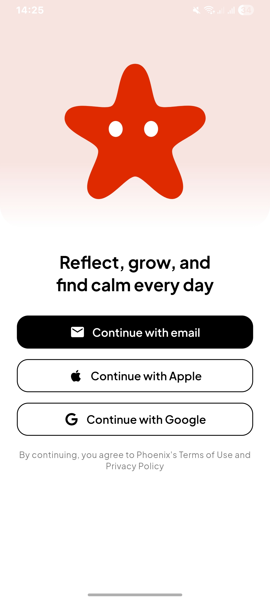
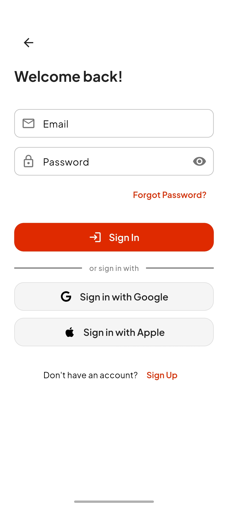
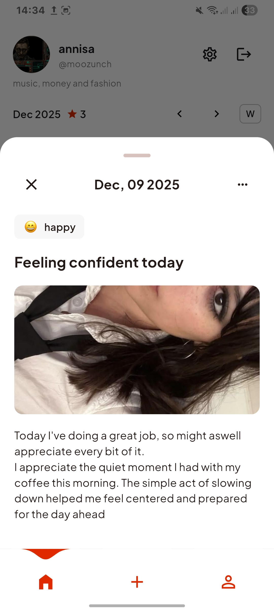
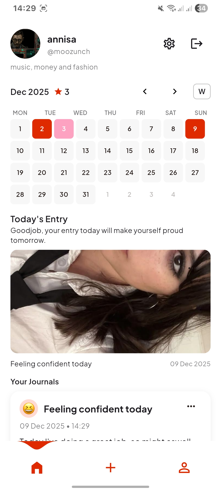
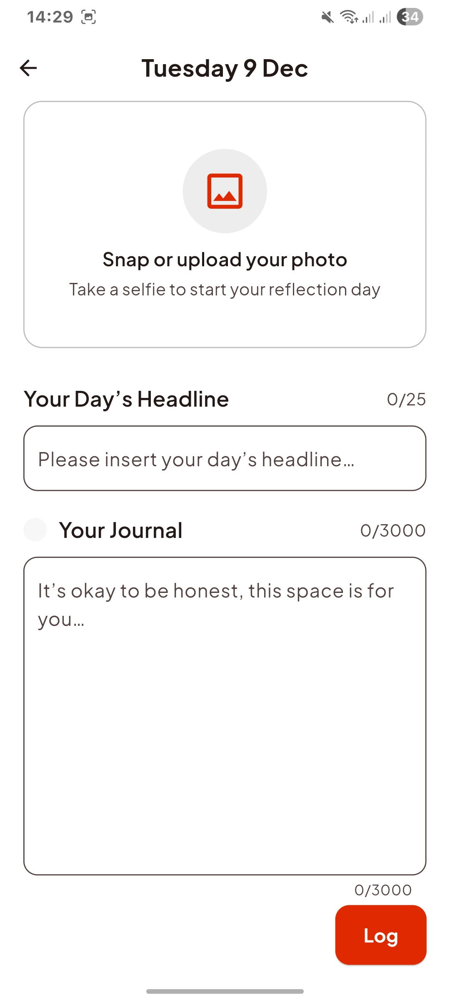
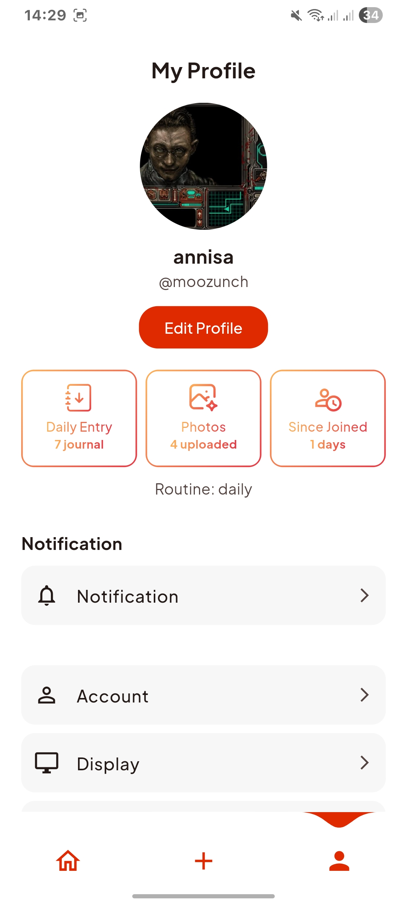
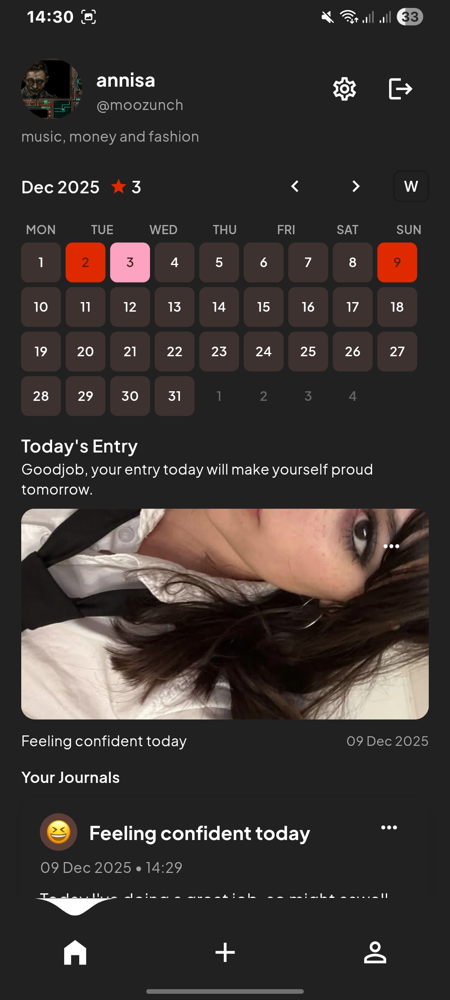
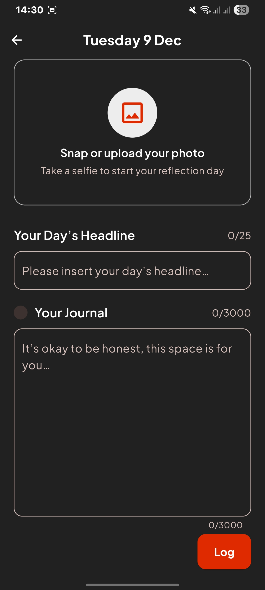
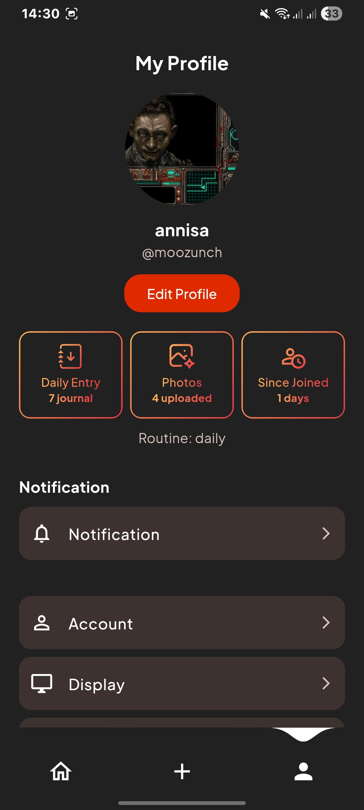

# Phoenix

## Introduction

Phoenix is a safe and supportive mobile app designed for individuals with face dysmorphia, helping them in the journey of self-acceptance, monitoring facial condition, and building daily habits to ease anxiety. Phoenix empowers users with a private journal platform, routine photo tracking, and smart reminders to consistently build positive habits. The app is built with Flutter and integrates Firebase, Supabase, and awesome_notifications for a secure, modern experience.

## Features

- Secure onboarding and authentication (email, Google, Apple)
- Private journal for daily reflections and self-acceptance
- Routine photo monitoring to track progress and changes
- Mood picker dialog and photo upload sheet
- Daily/weekly habit reminders powered by awesome_notifications
- Supabase and Firebase integration for data and user management
- Responsive UI with custom theming (Plus Jakarta Sans)
- Home tab with action tiles, mood history, and progress overview
- App icon and native splash generated from a single PNG asset

### Planned / Future Consideration
- Online Push notification settings
- More mood options and analytics
- MFA
- Further settings implementation

## Tech Stack

- Flutter (Material 3)
- go_router (routing)
- Firebase (Auth, Firestore, Storage, App Check)
- Supabase (user management)
- SharedPreferences (local persistence)
- Lottie (animations)
- awesome_notifications (local notifications)

## Project Structure

```
lib/
  main.dart                  # App entry, router, theme wiring
  core/
    app_state.dart           # AppState (user, onboarding, routine, etc)
    models/                  # UserModel, mood, etc
  screens/
    boarding_screen.dart     # Onboarding UI
    sign_in_page.dart        # Sign-in UI
    sign_up_page.dart        # Sign-up UI
    forgot_password_page.dart# Forgot password UI
    verify_email_page.dart   # Email verification UI
    home.dart                # Home tab
    tab_scaffold.dart        # Main tab scaffold
  services/
    auth_service.dart        # Auth logic
    notification_service.dart# Local notification logic
    supabase_user_service.dart# Supabase user logic
  styles/
    app_palette.dart         # Brand colors
  widgets/
    app_text_field.dart      # Custom text field
    app_link_button.dart     # Custom link button
    upload/
      mood_picker_dialog.dart# Mood picker dialog
      photo_picker_sheet.dart# Photo picker bottom sheet
assets/
  fonts/                     # Plus Jakarta Sans
  images/                    # App icons, onboarding, etc
  json/                      # Lottie files
  phoenix_logo.png           # App icon & splash source image
```

## Screenshots

<table>
	<tr>
		<td></td>
        <td></td>
        <td></td>
	</tr>
	<tr>
		<td></td>
        <td></td>
        <td></td>
	</tr>
    <tr>
		<td></td>
        <td></td>
        <td></td>
	</tr>
</table>

## Download

- Go to the [Releases page](https://github.com/moozunch/phoenix/releases)
- On the latest release page, download `app-release.apk` and install it on your Android device.
- If installation is blocked, enable “Install unknown apps” for your browser or file manager.
- Builds are created by GitHub Actions and signed with the release keystore.

## Changelog

- All changes are documented in [GitHub Releases](https://github.com/moozunch/phoenix/releases)
- Each tag (e.g., `v1.0.0`) contains:
  - What’s New: highlights of features and improvements
  - Security: signing and backend configuration notes

## Routing

Routes are defined with go_router in app_router.dart:

- `/boarding` Onboarding
- `/signin` Sign in
- `/signup` Sign up
- `/forgot_password` Forgot password
- `/verify_email` Email verification
- `/home` Main app
- `/routine_selection` Routine onboarding

## State and Persistence

`AppState` stores user, onboarding, and routine state. Data is persisted via SharedPreferences and synced with Firebase/Supabase as needed.

## Theming and Design Tokens

- Primary brand color is defined in app_palette.dart
- Font: Plus Jakarta Sans is bundled and set as the app font
- All colors and radii are centralized for consistency

To change the brand color:
- Update `AppPalette.primary` in app_palette.dart

## Assets, Icon, and Splash

- All assets are registered in pubspec.yaml
- App icon and splash are generated from phoenix_logo.png using:
  - `flutter_launcher_icons`
  - `flutter_native_splash`

If you replace the logo, regenerate assets:

```powershell
# Regenerate launcher icons
dart run flutter_launcher_icons

# Regenerate native splash
dart run flutter_native_splash:create
```

Notes:
- iOS icons require no alpha channel; set `remove_alpha_ios: true` in config
- Web theme color is aligned to the brand color in pubspec.yaml

## Development

Install dependencies:

```powershell
flutter pub get
```

Run on a device or Chrome:

```powershell
flutter run
```

Build Android APK:

```powershell
flutter build apk
```

Build iOS (on macOS):

```bash
flutter build ios
```

Run tests:

```powershell
flutter test
```

Static analysis:

```powershell
dart analyze
```

## Customization

- Routine options: update logic in notification_service.dart
- Theme tweaks: adjust app_palette.dart
- Onboarding/mood assets: update in images and json

## Troubleshooting

- Windows builds with plugins require Developer Mode (symlink support). Enable via Settings → Privacy & security → For developers → Developer Mode.
- Icons/splash not updating: replace logo, regenerate, then rebuild. On Android, uninstall/reinstall may be required; launchers can cache icons. On Web, clear site data or hard refresh (Ctrl+F5).
- Deprecated APIs: this project uses latest Flutter patterns and avoids deprecated properties.

## License

This project is licensed under the terms of the [LICENSE](LICENSE) file included in the repository.

## Acknowledgements

- Flutter team and the authors of go_router, Firebase, Supabase
- Plus Jakarta Sans font

---
